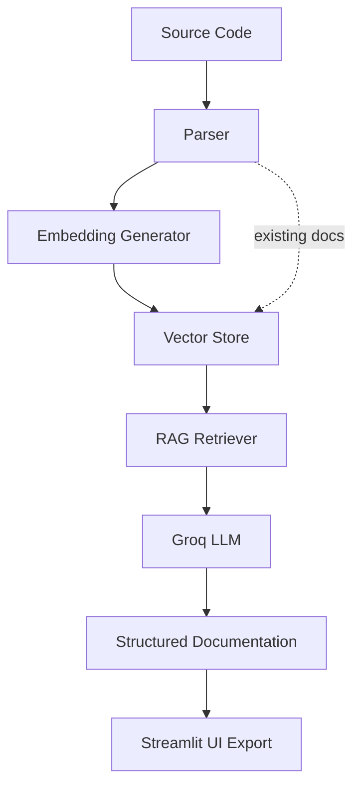

# 🤖 AI Documentation Generator (RAG-Powered)

A production-ready **AI documentation generator** built with **Retrieval-Augmented Generation (RAG)**.

Upload source code and instantly receive **structured API documentation with examples**, powered by **Groq LLM + vector embeddings**.

Designed to help developers convert code into clean, professional documentation with minimal effort.

---

## 🚀 Features

✅ Python support (current MVP)  
✅ RAG Context Engine (ChromaDB)  
✅ Parallel LLM execution  
✅ Structured JSON output  
✅ Markdown + JSON export  
✅ Streamlit Web UI  
✅ Persistent documentation store  
✅ Production-safe architecture  

> ⚠️ Multi-language support (JavaScript, TypeScript, Java, C++, Go) is planned — see Future Enhancements.

---

## 🧠 Architecture

## Core Components

 - Parser – Extracts functions and metadata from source code

 - RAG Engine – Generates embeddings and retrieves contextual information

 - Groq LLM – Produces structured documentation (JSON)

 - Streamlit UI – Interactive frontend for uploads and exports

 - Documentation Store – Persistent archive of generated docs

## ⚙️ Tech Stack

 - Python 3.10+

 - Streamlit

 - Groq (Llama-3.3-70B)

 - ChromaDB

 - Sentence Transformers

 - Concurrent Futures

 - Pydantic

## 🛠 Installation
1️⃣ Clone the repository

git clone https://github.com/YOUR_USERNAME/ai-doc-generator.git
cd ai-doc-generator

2️⃣ Create virtual environment

python -m venv venv
source venv/bin/activate   # Windows: venv\Scripts\activate

3️⃣ Install dependencies

pip install -r requirements.txt

4️⃣ Configure environment variables

Create a .env file:

GROQ_API_KEY=your_key_here

5️⃣ Run the app
streamlit run app.py

## 📄 Output Format

Each function generates structured documentation:

{
  "description": "...",
  "parameters": [],
  "returns": "",
  "example": "",
  "notes": ""
}

Exports available as:

 - Markdown (.md)

 - JSON (.json)

## 🚀 Future Enhancements

While the current version focuses on Python codebases, the architecture is intentionally designed to scale.

## 🌍 Multi-Language Support

 - Planned additions:

 - JavaScript / TypeScript

 - Java

 - C++

 - Go

**Implemented via language-specific parsers and prompt templates**.

## 📦 Repository-Wide Documentation

 - Process entire GitHub repositories

 - Recursive folder traversal

 - Project-level API references

 - Unified documentation sites (Markdown / HTML)

## 🧠 Advanced RAG Improvements

 - Intelligent chunking for large files

 - Semantic grouping by module

 - Cross-file dependency awareness

 - Persistent vector storage

 - Hybrid search (semantic + keyword)

## 🔄 Incremental Documentation Updates

 - File hashing for change detection

 - Regenerate docs only for modified functions

 - Historical documentation versions

## 📄 Multiple Export Formats

 - HTML static docs

 - PDF export

 - OpenAPI / Swagger generation

 - MkDocs / Docusaurus integration

## 🔐 Authentication & User Projects

 - Login system

 - Per-user project storage

 - Saved documentation history

 - Cloud dashboards

## ⚡ Performance & Scalability

 - Background job queues (Celery / Redis)

 - Async LLM calls

 - Batch embeddings

 - Streaming UI updates

 - Aggressive caching

## 🧪 Testing & CI Integration

 - GitHub Actions

 - Auto-documentation on PRs

 - Documentation quality scoring

 - Coverage reports for undocumented functions

## 🧩 IDE Plugins

 - VS Code extension

 - Inline documentation previews

 - One-click generation from editor

## 📊 Quality Metrics

 - Documentation completeness score

 - Parameter coverage percentage

 - Readability metrics

 - Function complexity indicators

## 🧭 Vision

**Transform this project into a full AI-powered Documentation Platform that integrates directly into developer workflows and CI pipelines — enabling teams to maintain accurate, consistent documentation with minimal manual effort**.
