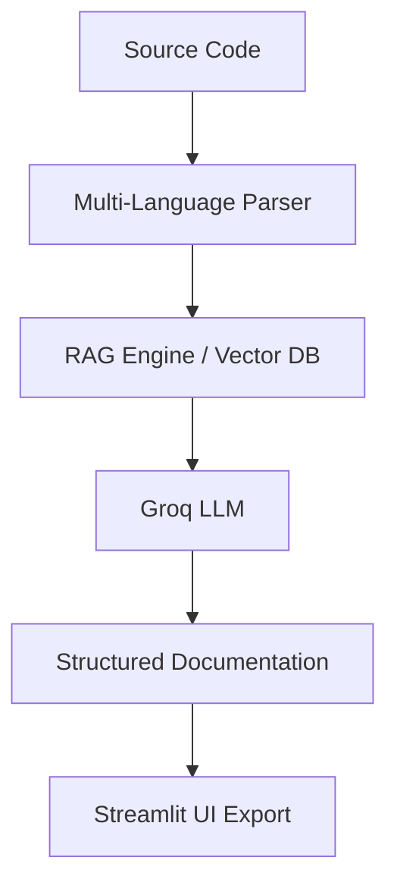

# 🤖 AI Documentation Generator (RAG-Powered)

A production-ready **Python AI documentation generator** built with **Retrieval Augmented Generation (RAG)**.

Upload source code and instantly get structured API documentation with examples — powered by Groq LLM + vector embeddings.

---

## 🚀 Features

✅ Multi-language support  
(Python, JavaScript, TypeScript, Java, C++, Go)

✅ RAG Context Engine (ChromaDB)

✅ Parallel LLM execution

✅ Structured JSON output

✅ Markdown + JSON export

✅ Streamlit Web UI

✅ Production-safe architecture

---

## 🧠 Architecture




### Components

- **Parser** – Extracts functions from multiple languages  
- **RAG Engine** – Builds embeddings + retrieves contextual docs  
- **Groq LLM** – Generates structured documentation  
- **Streamlit UI** – Frontend interface  
- **Doc Store** – Persistent documentation archive  

---

## ⚙️ Tech Stack

- Python 3.10+
- Streamlit
- Groq (Llama-3.3-70B)
- ChromaDB
- Sentence Transformers
- Concurrent Futures
- Pydantic

---

## 🛠 Installation

## 1️⃣ Clone

```bash
git clone https://github.com/YOUR_USERNAME/ai-doc-generator.git
cd ai-doc-generator

## 2️⃣ Create Virtual Environment
python -m venv venv
source venv/bin/activate   # Windows: venv\Scripts\activate

## 3️⃣ Install Dependencies
pip install -r requirements.txt

## 4️⃣ Environment Variables

Create .env:

GROQ_API_KEY=your_key_here

## 5️⃣ Run App
streamlit run app.py

📄 Output Example

Each function produces:

{
  "description": "...",
  "parameters": [],
  "returns": "",
  "example": "",
  "notes": ""
}

## 🚀 Future Enhancements

While the current version focuses on Python codebases, the architecture is designed to be extensible. Planned and potential improvements include:

## 🌍 Multi-Language Support

Extend the parser layer to support additional languages such as:

 - JavaScript / TypeScript

 - Java

 - C++

 - Go

**This can be achieved by adding language-specific parsers and adapting the prompt templates accordingly**.

## 📦 Repository-Wide Documentation

 - Instead of single-file processing:

 - Generate documentation for entire GitHub repositories

 - Automatically traverse folders

 - Build project-level API references

 - Produce unified Markdown / HTML documentation sites

## 🧠 Advanced RAG Improvements

 - Enhance retrieval quality by:

 - Chunking large files intelligently

 - Semantic grouping by module/package

 - Cross-file dependency awareness

 - Persistent vector storage for large projects

 - Hybrid search (semantic + keyword)

## 🔄 Incremental Documentation Updates

 - Avoid regenerating everything:

 - Detect code changes via file hashes

 - Regenerate docs only for modified functions

 - Maintain historical documentation versions

## 📄 Multiple Export Formats

 - Support additional output formats:

 - HTML static documentation

 - PDF export

 - OpenAPI / Swagger generation

 - MkDocs / Docusaurus integration

## 🔐 Authentication & User Projects

 - Enable multi-user workflows:

 - Login system

 - Per-user project storage

 - Saved documentation history

 - Cloud-hosted dashboards

## ⚡ Performance & Scalability

 - Production optimizations:

 - Background job queues (Celery / Redis)

 - Async LLM calls

 - Batch embeddings

 - Streaming UI updates

 - Caching of repeated generations

## 🧪 Testing & CI Integration

 - Developer tooling:

 - GitHub Actions integration

 - Auto-doc generation on PRs

 - Quality scoring for generated docs

 - Coverage reports for undocumented functions

## 🧩 IDE Plugins

 - Developer experience improvements:

 - VS Code extension

 - Inline documentation previews

 - One-click doc generation from editor

## 📊 Quality Metrics

 - Add observability:

 - Documentation completeness score

 - Parameter coverage %

 - Readability metrics

 - Function complexity indicators

## 🧭 Vision

**Transform this tool into a full AI-powered Documentation Platform that integrates directly into developer workflows and CI pipelines — enabling teams to maintain accurate, consistent documentation with minimal manual effort**.